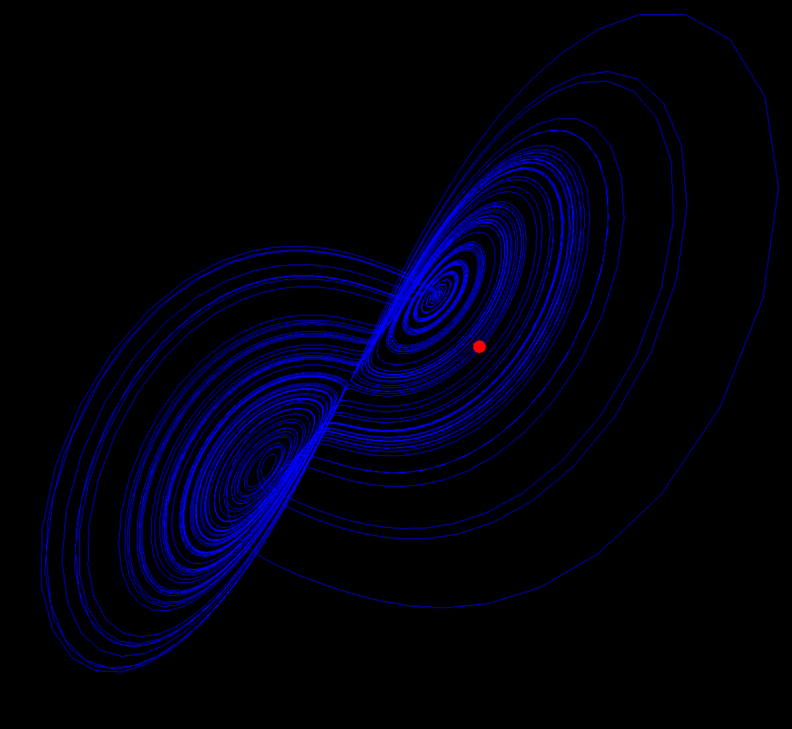

# Lorenz Attractor Visualization

## Overview

This repository contains a one-page website that visualizes the Lorenz Attractor—a set of chaotic solutions to the Lorenz equations. The Lorenz Attractor serves as a simplified mathematical model for atmospheric convection and is a classic example illustrating the concept of chaos theory. The visualization includes a 3D path (the attractor) and an animated ball representing a point evolving over time according to the Lorenz equations.



## Live Demo

For a live demo, visit [Strange Attractor Visualization](https://newsplanetai.com/strange/).

## Technologies Used

- HTML
- JavaScript
- Three.js for WebGL rendering

## How to Run Locally

1. Clone this repository.
    ```bash
    git clone https://github.com/yourusername/LorenzAttractorVisualization.git
    ```

2. Navigate to the repository folder.
    ```bash
    cd LorenzAttractorVisualization
    ```

3. Open `index.html` in your web browser.

## What You'll Learn

- **Chaos Theory**: Understand the basics of how deterministic systems can produce unpredictable outcomes.
  
- **Strange Attractors**: Get a glimpse of how systems can evolve into a complex set of states, represented by the fractal-like geometry of the Lorenz attractor.

- **Three.js and WebGL**: Learn how to create 3D graphics and animations in the browser.
